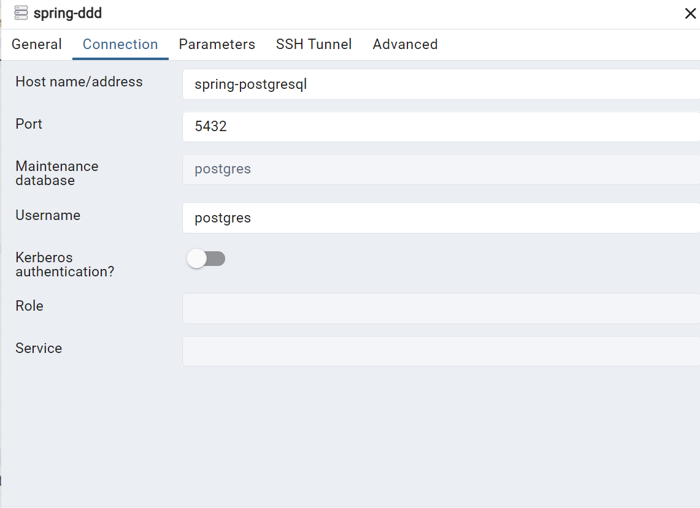

# Intelligent Document Management System
This project is a Java-based Intelligent Document Management System (DMS) that leverages cutting-edge AI technologies to revolutionize the way you manage and interact with documents. 
It incorporates advanced features powered by artificial intelligence to offer unparalleled efficiency and productivity. 

Our primary objective is to empower users with the ability to interact with the document repository conversationally. 
By leveraging Language Model-based Systems (LLMs), our DMS allows users to query the repository in a natural and conversational manner

The system aims to intelligently categorizes, searches, and analyzes your documents, allowing you to focus on what truly matters.
Our system leverages cutting-edge AI technologies to revolutionize the way you manage and interact with documents.

## [Architecture](Architecture.md)

This project employs a blend of architectural patterns, incorporating Domain-Driven Design (DDD), Command Query Responsibility Segregation (CQRS), hexagonal architecture, and Domain Events. 
It has been enhanced to include support for Elasticsearch, providing powerful search capabilities directly integrated with the Java API Client recommended for Spring Boot 3.x applications.

Additionally, support for Spring AI using OpenAI has been added to perform retrieval augmented generation. 
This is facilitated by utilizing the pgVector extension for PostgreSQL as our vector store, seamlessly integrated into the document lifecycle when adding a new document.

## Spring AI - OpenAI Configuration

To use this project, you should create an OpenAI account ,if you don't already have one, and store your OpenAI key in the `application.yaml` file. In my case, I used an environment variable called `OPENAI_API_KEY`.

You can also adapt the model to use via the property `spring.ai.openai.chat.model`.

```yaml
spring:
  ai:
    openai:
      api-key: ${OPENAI_API_KEY}
      chat:
        model: "gpt-3.5-turbo-1106"
```

Make sure to replace `"gpt-3.5-turbo-1106"` ,that I am using, with the model you intend to use for chat generation.

## Database Setup and Tools

## Liquibase for Database Versioning
Liquibase is used to manage database migrations and schema changes. Changesets are organized in the `src/main/resources/db/changelog` directory, allowing for structured and version-controlled database updates.

### pgAdmin (Docker container)

- **Container Name:** spring-pgadmin
- **URL:** [http://localhost:8088/browser/](http://localhost:8088/browser/)
- **Username:** emileastih1@gmail.com
- **Password:** toor

Configure pgAdmin to connect to the PostgreSQL instance as shown in the image below:



### PostgreSQL (Docker container)

- **Container Name:** spring-postgresql
- **URL:** [http://localhost:5432/](http://localhost:5432/)
- **Password:** toor
- **Port:** 5432

### Elasticsearch Setup

The project now includes Elasticsearch support, utilizing the Java API Client which is the recommended approach for Spring Boot 3.x versions. This is in response to the deprecation of the High Level REST Client in favor of the Java API Client since Elasticsearch 7.15.0. Basic Add and Get operations on Elasticsearch documents have been implemented.

- **Elasticsearch URL:** [http://localhost:9200/](http://localhost:9200/)
- **Query Documents:** [http://localhost:9200/document/_search?size=1000](http://localhost:9200/document/_search?size=1000)

## Application Access

The application can be accessed at:
- [http://localhost:8085/ddd](http://localhost:8085/ddd)

## Swagger UI

Explore the API using Swagger UI at:
- [http://localhost:8085/ddd/swagger-ui/index.html](http://localhost:8085/ddd/swagger-ui/index.html)

## Windows Docker Setup

To ensure Elasticsearch runs smoothly on Docker for Windows, especially within a WSL2 environment, execute the following commands:

```bash
wsl -d docker-desktop
sysctl -w vm.max_map_count=262144
sysctl vm.max_map_count
```

## Support

If you have any questions, encounter issues, or need assistance with this project, please don't hesitate to open an issue on GitHub.

[Open an Issue](https://github.com/emileastih1/architecture_ddd/issues)

Alternatively, you can reach out to us via email at:

📧 [emileastih1@gmail.com](mailto:emileastih1@gmail.com)

We're committed to addressing your concerns and providing the support you need to ensure your experience with this project is smooth and successful.